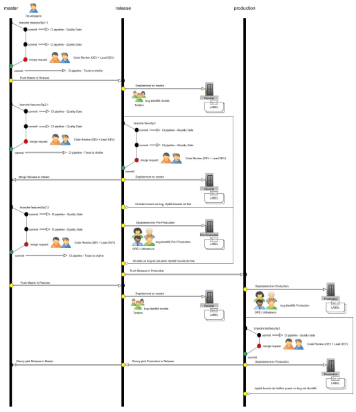
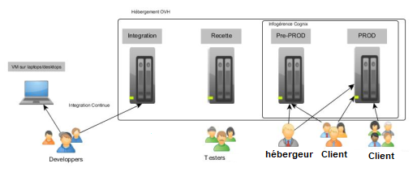

= Plan de gestion de configuration
:toc:

== Workflow Git
=== Generalites

=== Gestion de la configuration

La gestion de configuration se fait sur 3 branches fixes :

. Master
La branche Master est la branche principale. Cette branche contient toutes les fonctionnalités validées par Merge Requests. La plateforme de CI se met à jour automatiquement sur cette branche quand une Merge Request est appliquée Grâce à Gitlab-CI et PIPELINE.
. Release
La branche Release est la branche de recette. Cette branche contient une version taguée, testée et corrigée par les devs et par le client du sprint N-1. Ces corrections sont effectuées par Merge Request, où une Merge Request correspond à un ticket du Mantis.
. Production
La branche Production est la branche de production. Cette branche contient une version stable d’un tag effectué sur la branche Release. Les fixes sur cette branche sont décrits dans le 1.2.5 de ce document.

== Procédure
=== Développement des User Story
Le Développement d’une User Story sur la branche master est composé des 4 étapes suivantes :
    • Avant de commencer une fonctionnalité, il est nécessaire de créer une branche correspondant à la tâche qu'il souhaite faire. Cette branche est nommée FEAT_123 (#123 numéro de tache dans l'outil de gestion).
    • Tout au long de la réalisation de la tâche, le développeur pousse son travail sur cette branche. Ce push déclenche une inspection de code automatique.
    • Une Merge Request est envoyée lorsque la fonctionnalité est considérée comme terminée. Ce qui déclenche la phase de revue code (la revue de code donne l'occasion de relire et discuter sur le code produit).
    • La Merge Request de la fonctionnalité est validée dans la branche master si la revue de code est terminée.

=== Correction des tickets de recette
Pendant le Sprint N, la recette du Sprint N-1 est effectuée sur la branche Release en 4 étapes comme pour le développement d’une User Story :
    • Avant de commencer une correction d’un ticket, il est nécessaire de créer une branche correspondant au ticket concerné. Cette branche est nommée FIXE_121 (#121 numéro du ticket Mantis dans l'outil).
    • Tout au long de la correction du ticket, le développeur pousse son travail sur cette branche. Ce push déclenche une inspection de code automatique.
    • Une Merge Request est envoyée lorsque le ticket est considéré comme terminé. Ce qui déclenche la phase de revue code (la revue de code donne l'occasion de relire et discuter sur le code produit).
    • La Merge Request du ticket est validée dans la branche release si la revue de code est terminée.
=== Correction des tickets de VABF
Pendant le Sprint N, juste après la recette du Sprint N-1, une courte VABF est aussi effectuée sur la branche Release en 4 étapes comme décrit ci-dessus.

=== Mise en place d’Hotfixe
Il existe deux manières de traiter les bugs sur la plateforme de production, les hotfixes et les fixes :
    • Un hotfixe sur un bug ‘simple' sera directement déployé en production. Testé sur les environnements de développement du correcteur et du relecteur de la Merge Request, puis validé sur la production par le client.
    • Pour un Fixe sur un bug ‘compliqué', celui-ci sera testé sur la pré-production (qui est aussi la démo) et validé par le client.

== Plateforme
=== Généralités

Le projet est composé de 5 environnements dont 4 plateformes :

* L’environnement de développement relié à la branche ‘master’ est sur chaque poste de développement sous VM avec l’utilisation de conteneur Docker.
* L’environnement d’Intégration continu relié à la branche ‘master’ est sur la plateforme d’intégration continu. Cet environnement est mis à jour automatiquement grâce à Pipiline de GitLab.
* L’environnement de recette relié à la branche ‘release’ est sur la plateforme de recette. Cet environnement est mis à jour manuellement grâce à Pipiline de GitLab.
* L’environnement de Pré-production relié à la branche ‘release’ est sur la plateforme de Pre-PROD.
* L’environnement de Production relié à la branche ‘production’ est sur la plateforme de PROD.
